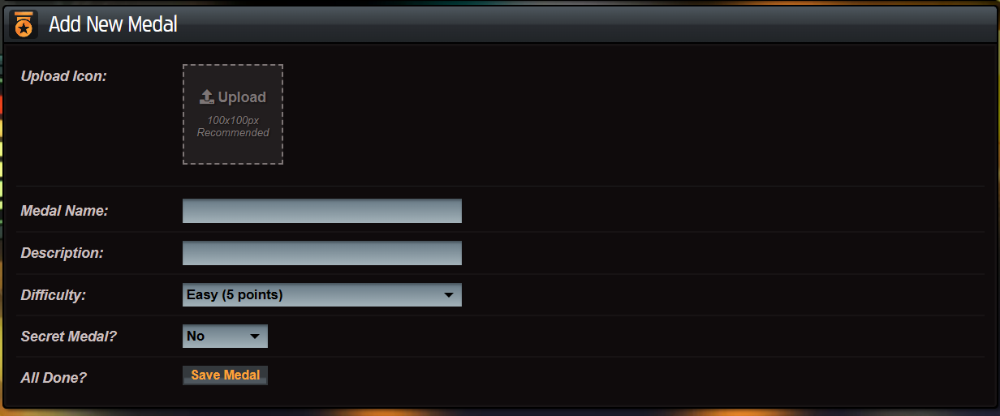
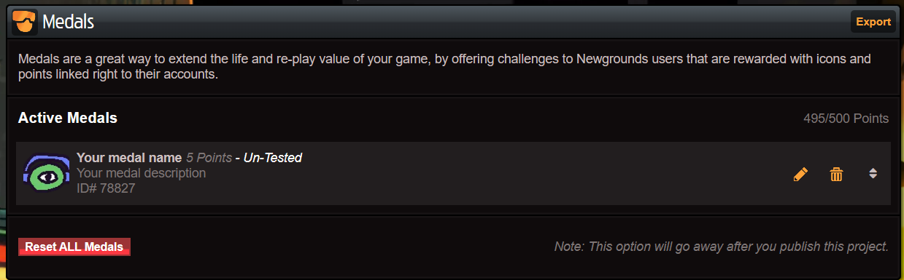

The medals in Newgrounds represents achievements that the player can unlock by 
performing specific actions in the game. This guide will show you how to use the 
Newgrounds.js library to unlock medals in your game.

## Creating a medal

To use medals, you need medals.

1. Go to the [Your Projects](https://www.newgrounds.com/projects) page in NG and
   select your already connected project.
2. Go to the bottom, to API Tools.
3. Select Medals in **Newgrounds.io Components** section. 
4. Now you can create a new medal, with a name, description, and icon.



Now, your medal should be shown in the **Medals** section of your project.



You need the id, in this case, `78827`, to unlock the medal in your game.

## Unlocking a medal

To unlock a medal in your game, you can use the `unlockMedal` method.

```js
unlockMedal(78827);
```