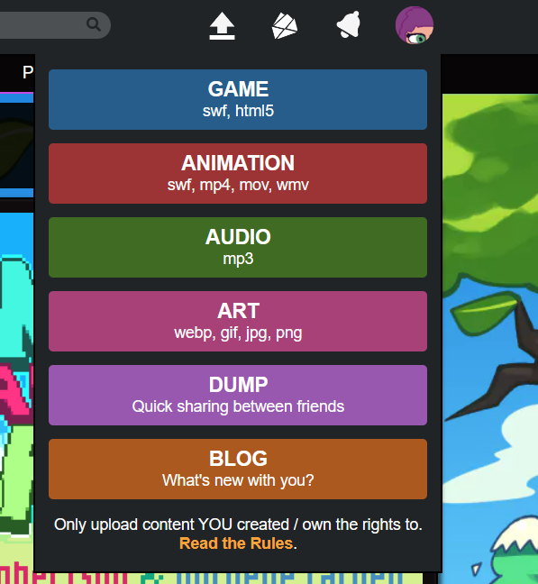
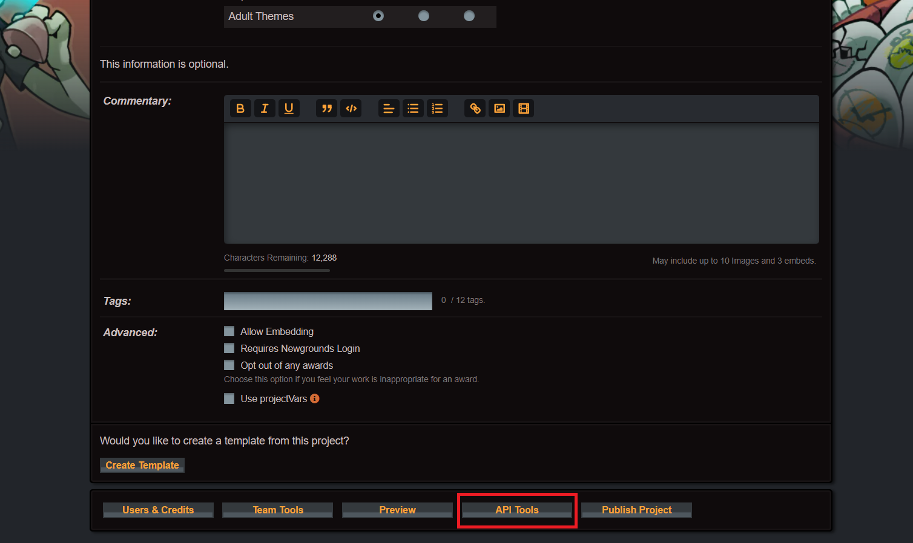
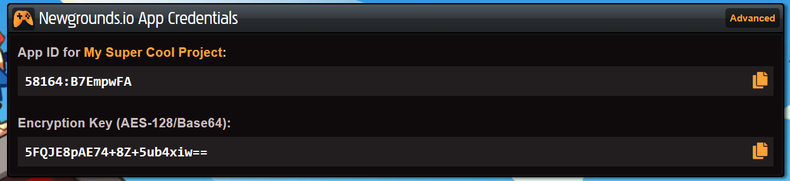

import { Aside } from "@astrojs/starlight/components";

Once you have installed Newgrounds.js, you can start using it in your game. Here
is a quick guide to get you started. 

The first thing that you have to do is get your credentials from Newgrounds.com.

1. Go to [Newgrounds.com](https://www.newgrounds.com) and create an account.
2. Create a Game Project in Newgrounds

3. Now, go to the bottom and you will see an Api Tools buttons. Click on it.

4. Now you will see your App ID and Encryption Key. Copy them.

